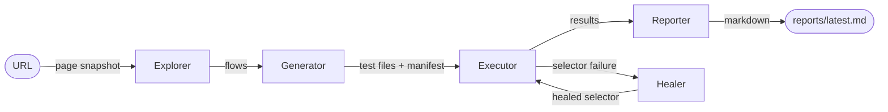

# QA Agent

> Autonomous browser test authoring: give it a URL, get a runnable Playwright suite in under 60 seconds.

[](https://github.com/to7vx/QA-agent/actions/workflows/ci.yml)
[](https://python.org)
[](https://github.com/astral-sh/ruff)
[](https://mypy-lang.org)
[](https://anthropic.com)

<!-- Demo GIF: drop docs/assets/demo.gif here once captured -->
<!--  -->

---

## The problem

Writing a test suite for an unfamiliar app means two manual steps that don't require human judgment: figuring out which user flows matter on a page you've never seen, and keeping selectors up to date every time the UI changes. The first is a reading-comprehension task; the second is a find-the-moved-element task. Both are things an agent can do faster and more consistently than a person.

## What this is

QA Agent takes a URL and runs a four-stage pipeline — explore, generate, execute, heal — producing a Playwright test suite and a diagnostic markdown report with no manual test authoring. When the UI changes and a selector breaks, the agent re-captures the live DOM and asks Claude to find the same logical element in its new position, refusing to act if it can't find a confident match. The key differentiator from other AI test tools: every healing decision is logged with its confidence score and reasoning, so the agent's behavior is auditable rather than opaque.

v1 supports single-page flows on public sites. Authenticated flows and multi-page crawling are roadmap items.

## Demo

<!-- Pipeline terminal recording — replace placeholder when captured -->
<!--  -->

<!-- Markdown report rendered on GitHub — replace placeholder when captured -->
<!--  -->

<!-- Self-healing log showing original → new selector → confidence → outcome -->
<!--  -->

---

## Key features

- Run `qa-agent run <URL>` and receive a Playwright test file for every identified user flow, prioritized by business impact
- Selector healing that refuses to guess: below 0.7 confidence, the agent logs a refusal rather than silently corrupting a passing test
- Every healing attempt logged to `reports/healing_stats.json` — original selector, replacement, confidence, outcome — so drift toward overconfident repairs is visible over time
- Per-failure analysis: Claude identifies the specific root cause and writes a copy-pasteable fix, not a generic "check your selectors" message
- Four independent CLI commands (`explore`, `generate`, `execute`, `run`) for running individual pipeline stages without re-running the full flow
- Syntax validation with one-shot repair: generated tests are checked with `ast.parse()` and Claude fixes them before they're written to disk

---

## Architecture



The pipeline is a typed assembly line: each stage receives and returns strict Pydantic models, so a malformed Claude response fails loudly at the boundary rather than silently three steps later. Explorer produces `List[Flow]`, Generator consumes flows and produces `List[TestCase]` with associated `.py` files and a `manifest.json`. Executor runs each test in an isolated subprocess and returns `List[TestResult]`. When a result carries a `failing_selector` extracted from the pytest output, the Healer intercepts: it re-opens the live page using the sync Playwright API, re-captures the current DOM and accessibility tree, and sends them to Claude with the original test code and a strict prompt that demands semantic matching. If confidence clears 0.7, the test file is rewritten in place and re-run once. The manifest decouples generation from execution — the executor is stateless and reads only from `manifest.json`, which means tests can be re-run or manually edited without touching the generator.

---

## Tech stack

| Layer | Technology | Why |
|-------|-----------|-----|
| AI | Anthropic Claude (`claude-sonnet-4-6`) | Reliable structured JSON outputs with sufficient context length for full DOM payloads; the healing and analysis prompts require multi-step reasoning |
| Browser | Playwright (async + sync APIs) | First-class Python bindings, built-in accessibility tree snapshots, and a sync API that creates its own event loop — safe to call from within async contexts without `nest_asyncio` |
| Data contracts | Pydantic v2 | Validates Claude's JSON at every module boundary; a wrong field name or missing key surfaces immediately rather than propagating as a silent `None` |
| CLI | Click + Rich | Rich's `Live` context manager powers the animated test-progress table; Click handles the multi-command structure without boilerplate |
| Package manager | uv | Reproducible installs in under 10 seconds; `uv run` means users never need to activate a virtualenv manually |

---

## Getting started

### Prerequisites

- Python 3.11+
- [uv](https://docs.astral.sh/uv/) — `pip install uv` or `curl -LsSf https://astral.sh/uv/install.sh | sh`
- An [Anthropic API key](https://console.anthropic.com/)

### Install

```bash
git clone https://github.com/to7vx/QA-agent.git
cd QA-agent
uv sync
uv run playwright install chromium
```

### Configure

```bash
cp .env.example .env
```

Edit `.env` and set your key:

```
ANTHROPIC_API_KEY=sk-ant-...
```

### Run

```bash
uv run qa-agent run https://saucedemo.com
```

---

## Usage

### Full pipeline

```bash
uv run qa-agent run <URL>
```

Identifies flows, generates tests, runs them, and writes `reports/latest.md`. Self-healing is on by default.

```bash
uv run qa-agent run https://saucedemo.com --headed    # watch the browser
uv run qa-agent run https://saucedemo.com --no-heal   # disable healing for debugging
uv run qa-agent run https://saucedemo.com --open      # open the report when done
```

### Individual stages

```bash
# See which flows the agent identifies — no test files written
uv run qa-agent explore https://saucedemo.com

# Generate test files only
uv run qa-agent generate https://saucedemo.com

# Run whatever is in generated_tests/ (reads manifest.json)
uv run qa-agent execute
uv run qa-agent execute --no-heal
```

### Environment variables

| Variable | Default | Description |
|----------|---------|-------------|
| `ANTHROPIC_API_KEY` | *(required)* | Anthropic API key |
| `QA_AGENT_MODEL` | `claude-sonnet-4-6` | Claude model override |
| `QA_AGENT_HEADLESS` | `true` | Headless browser mode |
| `QA_AGENT_OUTPUT_DIR` | `generated_tests` | Where test files are written |
| `QA_AGENT_REPORT_DIR` | `reports` | Where reports and healing stats go |

---

## Web dashboard & API

Beyond the CLI, qa-agent ships a FastAPI service and a Next.js dashboard
(persisted run history, live SSE progress, analytics, BYOK keys, multi-tenant
auth, and per-run LLM cost tracking).

Run the whole stack locally with one command:

```bash
docker compose up --build
# Dashboard → http://localhost:3000
# API + interactive docs → http://localhost:8000/docs
```

This starts Postgres + API + dashboard in no-auth mode (no Supabase required).
Provide `GEMINI_API_KEY` or `ANTHROPIC_API_KEY` for real runs.

## Deploy

See **[DEPLOYMENT.md](DEPLOYMENT.md)** for production deployment — the API to a
container host (Fly.io / Railway / Render) with Postgres, and the dashboard to
Vercel — plus the required environment variables and how to generate the
encryption key.

## Develop

```bash
uv sync --extra api --group dev && uv run pre-commit install
uv run ruff check . && uv run mypy src && uv run pytest
```

See **[CONTRIBUTING.md](CONTRIBUTING.md)** for conventions and the full command
reference, and **[SECURITY.md](SECURITY.md)** for the threat model.

---

## How it works

**Flow identification.** The Explorer launches headless Chromium and captures a structured page snapshot: the full HTML, a JavaScript-extracted inventory of interactive elements (buttons, inputs, links, forms — each with the most stable selector available, preferring `id` over `name` over `aria-label` over `class`), and Playwright's accessibility tree. That snapshot is formatted into a prompt and sent to Claude, which returns a JSON array of 3–7 flows ranked by priority. The schema is strict enough that the Generator can consume the output directly — no interpretation step.

**Test generation.** The Generator sends each flow to Claude alongside the page snapshot as selector context. The prompt enforces a selector preference ladder: `get_by_role` first, then `get_by_label`, `get_by_text`, stable attributes, CSS as a last resort. This produces tests that survive minor markup changes without needing healing. After generation, each file is validated with `ast.parse()`. A syntax failure triggers one repair attempt where Claude receives the broken code and the error; if repair also fails, the file is written with a comment prefix and skipped at execution time rather than crashing the runner.

**Execution and failure parsing.** Each test runs in its own subprocess via `sys.executable -m pytest`, keeping the agent's process isolated from test crashes. Failure output is parsed in two passes: first for the pytest summary line (`FAILED path::func - ErrorType: message`), then reversed over `E ...` lines for the full error detail. A separate pass extracts any Playwright selector from "waiting for" log lines — `locator('#id')`, `get_by_role(...)`, etc. A non-null `failing_selector` in the result metadata is the trigger for healing.

**The healing flow.** The Healer re-opens the live page using the sync Playwright API — chosen specifically because it manages its own internal event loop and is safe to call from within an `asyncio` context without `nest_asyncio`. It captures the current DOM and accessibility tree, then sends them to Claude with the original test code and a prompt that requires semantic matching: the replacement must be the same logical element (same role, same visible label, same purpose), not just any element that exists on the page. If Claude's confidence score clears 0.7, the test file is rewritten in place and re-run once. If the healed run fails, the original file is restored. Either way, the attempt is appended to `reports/healing_stats.json` — outcome, confidence, original selector, replacement, and reasoning — so you can audit whether the agent is being accurate or reckless over time.

---

## Project structure

```
qa-agent/
├── src/qa_agent/
│   ├── agent.py        orchestrator — wires all stages, owns the run() loop
│   ├── explorer.py     Playwright capture → Claude → List[Flow]
│   ├── generator.py    List[Flow] → Claude → List[TestCase] + writes .py files
│   ├── executor.py     List[TestCase] → subprocess pytest → List[TestResult]
│   ├── healer.py       selector failure → DOM re-capture → Claude → repaired test
│   ├── reporter.py     List[TestResult] → Claude analysis → markdown report
│   ├── models.py       Pydantic types: Flow, TestCase, TestResult, HealingAttempt, Report
│   ├── prompts.py      all Claude prompt strings — none defined elsewhere
│   ├── config.py       Settings via pydantic-settings + dotenv
│   └── cli.py          Click entry point: explore / generate / execute / run
├── generated_tests/    AI-generated test files + manifest.json (git-ignored)
├── reports/            markdown reports + healing_stats.json (git-ignored)
└── tests/              unit tests for the agent's own logic (29 tests)
```

---

## Limitations

- **SPA rendering delays.** The Explorer waits for `networkidle` with an 8-second timeout before proceeding. Pages with long-polling, infinite scroll, or heavy client-side hydration (React, Vue) can produce incomplete snapshots if they never settle.
- **No authenticated flows.** The agent has no session management and cannot reach login-gated pages. This is the highest-priority v2 item.
- **Single-page scope.** Each run targets one URL. Multi-page crawls and cross-page user journeys are not supported in v1.
- **Selector extraction is regex-based.** The healer detects failures by parsing pytest's text output. If Playwright changes its log format in a future release, extraction breaks silently — a known fragility.

---

## Roadmap

- [x] Page exploration and flow identification via Claude
- [x] Playwright test generation with selector preference ladder
- [x] Syntax validation with one-shot Claude repair
- [x] Subprocess execution with live Rich progress table
- [x] Per-failure root cause analysis and fix suggestions
- [x] Self-healing selector repair with confidence gate and audit log
- [ ] Authenticated flows (cookie / session injection)
- [ ] Multi-page crawl mode
- [ ] Parallel test execution
- [ ] REST API and webhook mode for CI integration
- [ ] HTML report with embedded screenshots

---

## Lessons learned

**Centralizing all prompts in `prompts.py`**

The first version inlined prompt strings inside the functions that used them. This made prompt changes require hunting through logic files, and it made the prompts invisible as design artifacts — you couldn't read the agent's strategy without reading the implementation. Moving every prompt to `prompts.py` as a module-level constant decoupled iteration from logic: changing how Claude identifies flows doesn't touch `explorer.py`. The discipline also forced clearer naming (`HEALER_SYSTEM` vs `HEALER_PROMPT`, `EXPLORER_SYSTEM` vs `EXPLORER_PROMPT`) that documents which calls use system prompts and which don't. The prompts are now the most reviewable part of the codebase.

**Pydantic models at every module boundary**

Each pipeline stage returns a typed model, not a dict. This seems like overhead until Claude returns JSON with a missing field or a wrong enum value — validation fails immediately at the boundary, not three layers later as a `KeyError` in unrelated code. It also meant each module could be built and tested independently: the Generator doesn't care how the Explorer produced its `List[Flow]`, only that it's valid. The tradeoff is that adding a field (e.g., `HealingAttempt` to `TestResult`) requires touching every layer that passes the model, but that's the right tradeoff — it makes schema evolution visible and intentional rather than quiet.

**The healing confidence gate**

Refusing to act below a threshold feels less impressive in a demo than a tool that always produces an answer. It matters more when a low-confidence heal silently changes an assertion target and nobody notices for several releases. The 0.7 threshold reflects what "I'm fairly sure this is the same element" means in practice: same role, same visible label, no ambiguity about which element on the page. The refusal record in `healing_stats.json` is equally important: if the threshold is too conservative, that's visible in the stats and adjustable. If it's too loose, that's also visible. Neither failure mode is silent, which is the actual goal.

**`manifest.json` as the execution boundary**

Decoupling generation from execution via a manifest file was the decision that made `qa-agent execute` independently useful. Without it, the executor would need to re-run the generator to know what to run, or glob test files without knowing their flow IDs, tags, or syntax validity. The manifest stores exactly what the executor needs — file path, flow name, tags, syntax validation status — and nothing else. It also means a developer can manually edit a generated test, run it directly with pytest, and then use `qa-agent execute` to get structured results. The manifest is the contract, not the source file.

---

## License

MIT — see [LICENSE](LICENSE) for details.

[to7vx](https://github.com/to7vx) · hanee877@gmail.com

